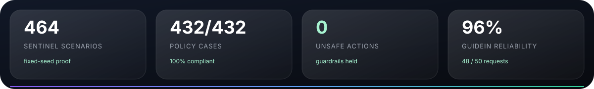

<div align="center">



<br/>

<a href="https://github.com/sufibuildwith-py?tab=repositories"></a>
<a href="https://linkedin.com/in/sufi-builds"></a>
<a href="mailto:sufiyan.builds.py@gmail.com"></a>

<br/><br/>

<a href="https://git.io/typing-svg"></a>

</div>

## `whoami`

I’m **Sufiyan Khan** — a B.Tech AI/ML student moving deep into **AI engineering and full-stack systems**. I build beyond the demo: governed agents, evidence-grounded RAG, backend APIs, offline desktop software, and interfaces people want to explore.

> **My edge:** I connect intelligent reasoning to deterministic software boundaries, then prove the system with real validation.



## `open ~/projects`

<table>
<tr>
<td width="50%" valign="top">
<h3>🛡️ Sentinel</h3>
<p><strong>Governed multi-agent revenue recovery</strong></p>
<p>Payment failures become Revenue Incidents. Gemini agents investigate with historical RAG evidence; a separate policy engine returns <code>AUTO</code>, <code>HUMAN</code>, or <code>DENY</code> before Razorpay Test Mode execution.</p>
<p><code>Java 17</code> <code>Spring Boot 3</code> <code>PostgreSQL</code> <code>Gemini</code> <code>Razorpay</code> <code>Docker</code></p>
<p><strong>464 scenarios · 29 categories · 8/8 safety gates</strong></p>
</td>
<td width="50%" valign="top">
<h3>🔎 Passport Document Advisor</h3>
<p><strong>Production offline document verification</strong></p>
<p>Extracts and cross-checks Aadhaar, PAN, Voter ID and Passport data from images and mixed PDFs—fully local, bilingual, MRZ-aware, reviewable, and exportable to Excel.</p>
<p><code>Electron</code> <code>TypeScript</code> <code>Tesseract.js</code> <code>PDF.js</code> <code>Sharp</code> <code>ExcelJS</code></p>
<p><strong>v1.0.7 · No cloud OCR · No internet dependency</strong> · <a href="https://github.com/sufibuildwith-py/OCR---Offline-Docs-Application">Repository ↗</a></p>
</td>
</tr>
<tr>
<td width="50%" valign="top">
<h3>🧭 GuideIn</h3>
<p><strong>AI career-guidance desktop application</strong></p>
<p>A responsive Java Swing conversation experience backed by structured Gemini REST requests, Jackson models, layered architecture, and asynchronous processing.</p>
<p><code>Java</code> <code>Swing</code> <code>Gemini API</code> <code>Jackson</code> <code>Maven</code></p>
<p><strong>50+ queries · 48/50 completed · 96% reliability</strong> · <a href="https://github.com/sufibuildwith-py/GuideIn">Repository ↗</a></p>
</td>
<td width="50%" valign="top">
<h3>✦ Sufiyan OS</h3>
<p><strong>A portfolio that behaves like an operating system</strong></p>
<p>Draggable glass windows, cursor-distance dock magnification, terminal commands, project orbitals, Control Center, desktop widgets, and a smooth cursor-scrubbed video wallpaper.</p>
<p><code>Next.js 14</code> <code>React 18</code> <code>TypeScript</code> <code>CSS Modules</code></p>
<p><strong>09 apps · reduced-motion aware · deployed</strong></p>
</td>
</tr>
</table>

## `system_profiler`

<div align="center">


<br/><br/>

`AGENTIC SYSTEMS` · `RAG` · `DETERMINISTIC POLICY` · `REST APIs` · `OFFLINE-FIRST` · `SYSTEM EVALUATION`

</div>

## `tail -f progress.log`

```text
NOW      → hardening agentic backends with deterministic financial guardrails
DEEPEN   → multi-agent orchestration, RAG evaluation, Spring Boot at scale
SHIP     → systems with measurable proof—not impressive-looking guesses
OPEN TO  → AI engineering · backend engineering · software internships
```

<details>
<summary><b>More signal: certifications & engineering background</b></summary>
<br/>

- **Backend Development Intern — Ideal Web Solutions:** shipped the offline OCR workflow used for identity-document verification.
- **Microsoft:** Generative AI Productivity Skills
- **LinkedIn Learning:** Calling REST APIs with Java · Large Language Models
- **Forage:** Wells Fargo Software Engineering · Tata iQ GenAI Data Analytics · Deloitte Data Analytics
- **Education:** B.Tech, Artificial Intelligence & Machine Learning · expected 2027

</details>

<br/>

<div align="center">

### Have a hard problem at the intersection of AI and software?

<a href="mailto:sufiyan.builds.py@gmail.com"></a>

<br/><br/>

<sub>Kanpur, India · English / Hindi · Building in public</sub>

</div>
